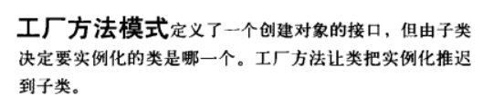

Java里边共有23种设计模式而工厂模式就有三种，它们分别是简单工厂模式（并不在23中模式之中），工厂方法模式以及抽象工厂模式，其中我们通常所说的工厂模式指的是工厂方法模式，工厂方法模式是日常开发中使用频率最高的一种设计模式，甚至在Android的源码中也是随处可见。

**简单工厂模式**
　　简单工厂模式其实并不算是一种设计模式，更多的时候是一种编程习惯。

**定义：**
　　定义一个工厂类，根据传入的参数不同返回不同的实例，被创建的实例具有共同的父类或接口。

**工厂方法模式**
　　工厂方法模式是简单工厂的仅一步深化， 在工厂方法模式中，我们不再提供一个统一的工厂类来创建所有的对象，而是针对不同的对象提供不同的工厂。也就是说每个对象都有一个与之对应的工厂。

**定义：**
　　定义一个用于创建对象的接口，让子类决定将哪一个类实例化。工厂方法模式让一个类的实例化延迟到其子类。
　　这次我们先用实例详细解释一下这个定义，最后在总结它的使用场景。

**抽象工厂模式**
　　这个模式最不好理解，而且在实际应用中局限性也蛮大的，因为这个模式并不符合开闭原则。实际开发还需要做好权衡。
　　抽象工厂模式是工厂方法的仅一步深化，在这个模式中的工厂类不单单可以创建一个对象，而是可以创建一组对象。这是和工厂方法最大的不同点。

**定义：**
　　提供一个创建一系列相关或相互依赖对象的接口，而无须指定它们具体的类。（ 在抽象工厂模式中，每一个具体工厂都提供了多个工厂方法用于产生多种不同类型的对象）

